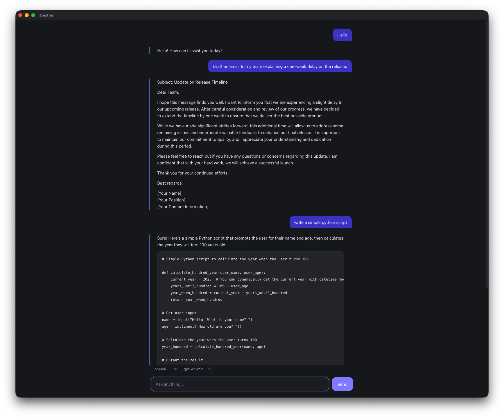

# LLMChatUI

A minimal, hackable desktop chat client for LLMs. Built with Electron, React, and TypeScript.

Not trying to be a polished product — it's a small, readable codebase you can fork and bend to whatever you need. Swap providers, add tools, wire it into another project. Everything fits in a few hundred lines.

## Features

- **Streaming responses** — tokens render as they arrive, with mid-generation cancel
- **Multiple providers** — OpenAI and Anthropic, switchable per message
- **Shared conversation history** — switch models mid-conversation without losing context
- **API keys never reach the renderer** — all provider calls happen in the main process

## Screenshot



## Getting started

```bash
git clone https://github.com/<you>/LLMChatUI.git
cd LLMChatUI
npm install
```

Copy the env template and fill in whichever keys you have:

```bash
cp .env.example .env
```

```
MAIN_VITE_OPENAI_API_KEY=sk-...
MAIN_VITE_ANTHROPIC_API_KEY=sk-ant-...
```

Then:

```bash
npm run dev
```

> The `MAIN_VITE_` prefix matters. electron-vite only injects variables with that prefix into the **main process** — a `RENDERER_VITE_` prefix would compile the key into the frontend bundle, where anything running in the page could read it.

## Architecture

Electron splits an app across three contexts, and this project keeps that split explicit:

```
src/
├── main/                  Node.js — full system access
│   ├── index.ts           window lifecycle, IPC handlers, menu
│   └── providers/         one file per LLM vendor
│       ├── types.ts       the Provider interface
│       ├── openai.ts
│       ├── anthropic.ts
│       └── index.ts       registry
├── preload/               the bridge — the only path between the two
│   ├── index.ts           contextBridge allowlist
│   └── index.d.ts         type declarations for window.api
├── renderer/              Chromium — UI only, no Node, no secrets
│   └── src/App.tsx
└── shared/                types imported by both sides
    └── types.ts
```

### Why provider calls live in the main process

The renderer is a browser page. It loads content, and in the threat model that makes it the untrusted side — an injected script or a compromised dependency could read anything in its scope. An API key sitting there would also ship in plain text inside the packaged `app.asar`, extractable with a single command.

So the renderer never sees a key. It sends a message array across IPC; the main process holds the credentials and makes the call.

### IPC channels

Two directions, because streaming needs both:

| Channel          | Mechanism           | Direction       | Purpose            |
| ---------------- | ------------------- | --------------- | ------------------ |
| `chat:send`      | `invoke` / `handle` | renderer → main | start a completion |
| `chat:chunk`     | `send` / `on`       | main → renderer | one token delta    |
| `chat:done`      | `send` / `on`       | main → renderer | stream finished    |
| `chat:abort`     | `send` / `on`       | renderer → main | cancel in flight   |
| `providers:list` | `invoke` / `handle` | renderer → main | available models   |

`invoke/handle` is request–response and returns exactly one value, which doesn't fit a token stream. So `chat:send` kicks things off and the deltas come back over a separate one-way channel.

### Adding a provider

Implement one interface:

```ts
export interface Provider {
  id: string
  models: string[]
  chat: (opts: ChatOptions) => Promise<void>
}
```

`chat` receives a `onDelta` callback and an `AbortSignal` and is responsible for nothing else — the caller owns cancellation, IPC, and UI state. Vendor quirks stay contained: Anthropic requires `max_tokens` and emits typed stream events, OpenAI doesn't and doesn't. Neither detail leaks past the provider file.

Register it in `src/main/providers/index.ts` and it appears in the UI automatically — the model picker is populated from `providers:list`, so no frontend changes are needed.

## Scripts

```bash
npm run dev          # dev server + Electron with HMR
npm run build        # typecheck and build
npm run build:mac    # package for macOS
npm run build:win    # package for Windows
npm run build:linux  # package for Linux
```

## Not built yet

Deliberately out of scope for now, roughly in order of usefulness:

- Conversation persistence and multiple sessions
- Syntax highlighting
- System prompts (needs a small `ChatOptions` addition — Anthropic takes `system` as a top-level parameter, OpenAI takes it as a message)
- Local models via Ollama (works through the OpenAI SDK with a different `baseURL`)
- Settings UI, with keys stored via `safeStorage` instead of `.env`
- Token counting and cost estimates

## Built with

[Electron](https://www.electronjs.org/) · [electron-vite](https://electron-vite.org/) · [React](https://react.dev/) · [TypeScript](https://www.typescriptlang.org/)

## License

MIT
