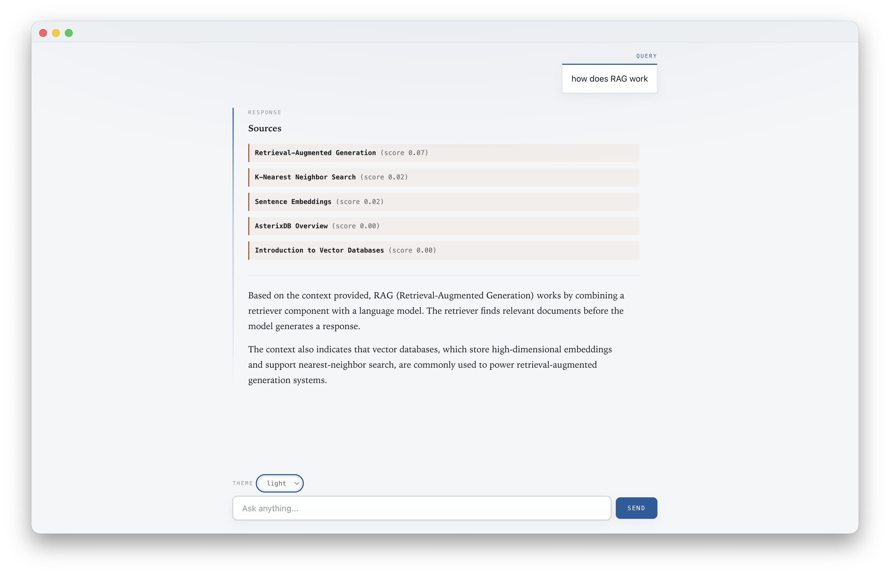
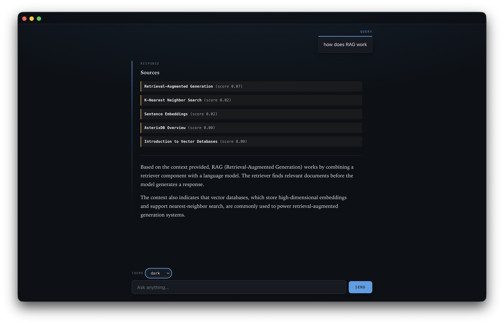

# KNN AsterixDB RAG — Frontend

An Electron + React desktop client for a retrieval-augmented research assistant. It is the UI half of a two-part senior design project: this app handles input, streaming display, and window chrome; a separate Python/FastAPI backend (`../backend`) handles retrieval (AsterixDB, exact k-NN over embeddings) and answer generation (Claude).

This app holds no API keys and never talks to AsterixDB or an LLM directly — it only ever calls its own backend's HTTP API.

## Graphical User Interface and Theme




## Getting started

The backend must be running first — see `../backend/README.md`. By default this app expects it at `http://localhost:8000`; override with the `BACKEND_URL` environment variable if it runs elsewhere.

```bash
npm install
npm run dev
```

## How a question becomes an answer

1. User types a question and hits Send.
2. Renderer calls `window.api.sendRagChat(question)` over IPC.
3. Main process `POST`s to the backend's `/chat`, which returns a Server-Sent Events stream.
4. Main process parses each SSE event and re-emits it over IPC as `rag:sources`, `rag:token`, `rag:error`, or `rag:done`.
5. Renderer listens for those events: `sources` renders the retrieved chunks first, `token` appends streamed answer text as it arrives, `done` clears the loading state.

The backend is the only thing that knows about AsterixDB or the LLM provider; this app just relays.

## Architecture

```
src/
├── main/               Node.js — window lifecycle, IPC handlers
│   └── index.ts          theme:set, rag:chat (SSE relay), rag:abort
├── preload/             the bridge — the only path between main and renderer
│   ├── index.ts           contextBridge allowlist
│   └── index.d.ts         type declarations for window.api
├── renderer/            Chromium — UI only, no Node, no secrets
│   └── src/App.tsx
└── shared/              types imported by both sides
    └── types.ts
```

### IPC channels

| Channel       | Mechanism           | Direction       | Purpose                                       |
| ------------- | ------------------- | --------------- | --------------------------------------------- |
| `theme:set`   | `invoke` / `handle` | renderer → main | switch light / dark / system theme            |
| `rag:chat`    | `invoke` / `handle` | renderer → main | ask a question                                |
| `rag:sources` | `send` / `on`       | main → renderer | retrieved chunks, sent before any answer text |
| `rag:token`   | `send` / `on`       | main → renderer | one piece of streamed answer text             |
| `rag:error`   | `send` / `on`       | main → renderer | something failed mid-stream                   |
| `rag:done`    | `send` / `on`       | main → renderer | stream finished (always fires exactly once)   |
| `rag:abort`   | `send`              | renderer → main | cancel the in-flight request                  |

`rag:chat` is `invoke`/`handle` so the renderer can `await` it, but the actual answer text arrives incrementally through the `rag:*` events above, not in that return value.

## Window chrome

The native title bar is hidden (`titleBarStyle: 'hidden'` in `main/index.ts`, macOS only). `.titlebar` in `main.css` is a plain draggable strip standing in for it (`-webkit-app-region: drag`), since hiding the title bar also removes the window's only way to be dragged.

## Scripts

```bash
npm run dev          # dev server + Electron with HMR
npm run typecheck    # tsc, no emit
npm run build         # typecheck and build
npm run build:mac    # package for macOS
npm run build:win    # package for Windows
npm run build:linux  # package for Linux
```

## Not built yet

- Conversation persistence across app restarts
- Showing more than title + score for each retrieved source (no chunk text/page preview yet)
- A settings UI for `BACKEND_URL` (environment variable only, for now)

## Built with

[Electron](https://www.electronjs.org/) · [electron-vite](https://electron-vite.org/) · [React](https://react.dev/) · [TypeScript](https://www.typescriptlang.org/)
